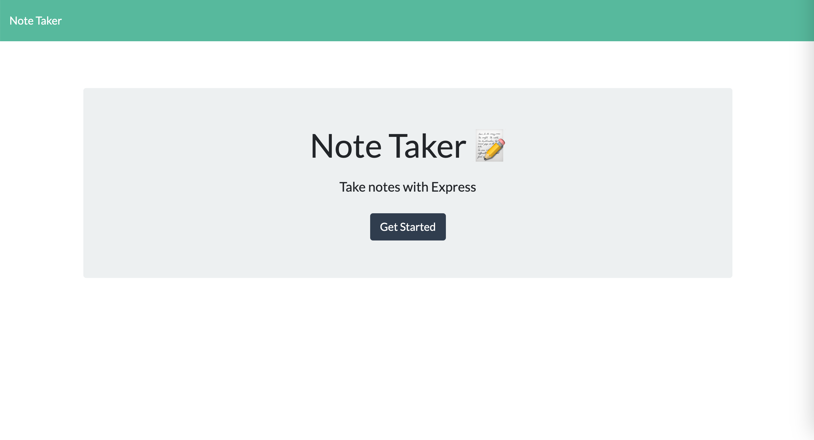
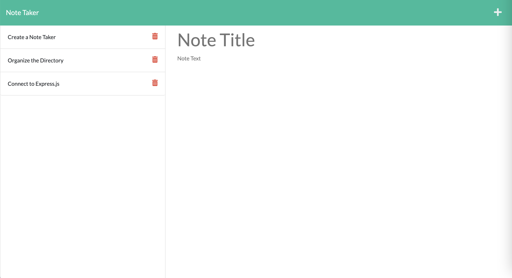

# Module 11 Challenge - Note Taker

>**Application Site:** [Note Taker](https://https://still-plains-67302.herokuapp.com/)
>
>**View:** [Description](#description) / [Application Details](#application-details) / [Application Sample Page](#application-sample-page)
>
>**Application Preview:**
>
>
> 
## **DESCRIPTION**
> Topic Assessed: **Express.js** - **Get, Post, Delete Requests, Modular Routing, server port, local database**
### **My Task**
*Note Taker* allows a user to add, save, and delete notes to keep track of information/tasks.
> Modify starter code.
> 
> Install the required packages for the application with the package.json file.
> 
> Create server.js file and define route paths.
>
> Create routes directory and respective files within.
>
> Use modular routing to connect mutiple files in the route folder.
>
> Use express get, post, and delete fetch requests to use data from the local server.
> 
> Use uuid package to generate uniquie identifier for each note taking item.
> 
> Use a helper fs file to read, write, and append the database.
> 
> Deploy the application using [Heroku](https://www.heroku.com).
> 
> **Note**: Completed Bonus - Note Taker can delete existing notes.
> 
## User Story
```
AS A small business owner
I WANT to be able to write and save notes
SO THAT I can organize my thoughts and keep track of tasks I need to complete
```
## Acceptance Criteria
```
GIVEN a note-taking application
WHEN I open the Note Taker
THEN I am presented with a landing page with a link to a notes page
WHEN I click on the link to the notes page
THEN I am presented with a page with existing notes listed in the left-hand column, plus empty fields to enter a new note title and the note’s text in the right-hand column
WHEN I enter a new note title and the note’s text
THEN a Save icon appears in the navigation at the top of the page
WHEN I click on the Save icon
THEN the new note I have entered is saved and appears in the left-hand column with the other existing notes
WHEN I click on an existing note in the list in the left-hand column
THEN that note appears in the right-hand column
WHEN I click on the Write icon in the navigation at the top of the page
THEN I am presented with empty fields to enter a new note title and the note’s text in the right-hand column
```

## **APPLICATION DETAILS**

### server.js Information
* **require**: Define packages needed for the application.
  * `express`, `path`
* **PORT**: Define the local PORT used to run the server.
  * Otherwise, allow the cloud server to use their own default port.
* **app.use**: Middleware for parsing json and urlencoded form data.
  * Define the static `public` directory.
* **app.get**: Define the GET route for the homepage and the main page.
* **app.listen**: Listen for connections and log the active port.

### routes index.js Information
* **require**: Define packages needed for the application.
* **noteRouter**: Import modular routers for `/notes`.

### routes notes.js Information
* **nts.get**: GET Route for retrieving all the notes.
  * Use `readFromFile` to read and return parsed json data/response.
* **nts.delete**: DELETE Route for a specific notes.
  * Define the id of the note.
  * Use `readFromFile` to parse the data and create a new array of all data except the one where the id matches the one in the url.
  * Use `writeToFile` to write the new array to the database file `db.json`
* **nts.post**: POST Route for submitting a new note.
  * Define the request body with the parameters `title` and `text`.
  * Check that both properties are present before saving the new object as a variable.
  * Use `readAndAppend` to add the note to the database file `db.json`.

### helpers fsUtils.js Information
* **readFromFile, writeToFile, readAndAppend**: Used to read, write, and append the database.
  * Code sourced from `edX Boot Camps LLC`

### package.json Information
* **package**: Define the dependencies/packages used in the application.
  * Dependencies: `express`, version ^4.16.4
  * devDependencies: `uuid`, version ^8.3.2

## **APPLICATION SAMPLE FILE**
### Sample Home Page & Main Page
>
>